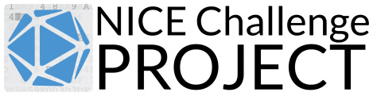

## WriteUps

Notes that to articulate problem solving methodologies from the following labs:

## NICE Challenge Project: [Visit](https://nice-challenge.com/)

## Tryhackme Cyber Security Training: [Visit](https://tryhackme.com)

## Hackthebox Pentest Labs [Visit](https://hackthebox.com)

## ImmersiveLabs [Visit](https://www.immersivelabs.com/)

